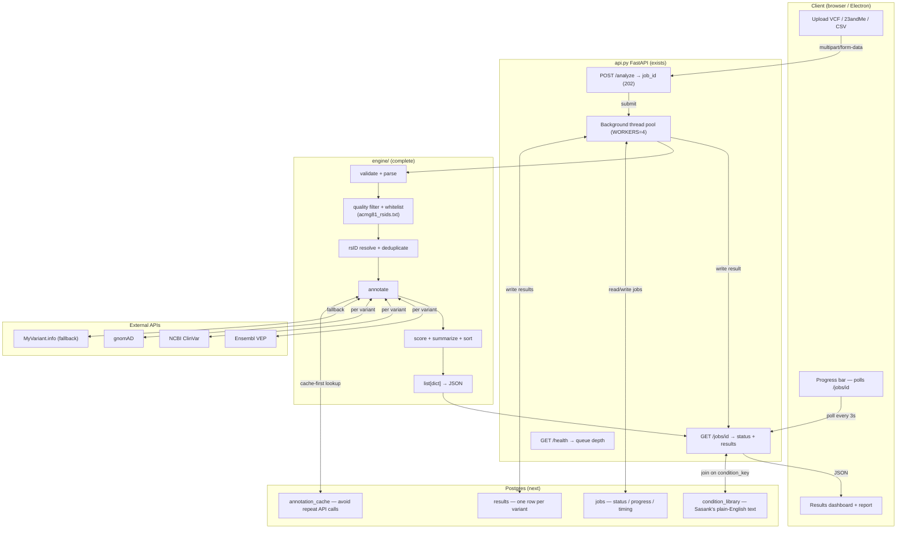

# Architecture

U4U takes a raw genome file, annotates each variant against clinical and population databases, scores findings, and returns plain-English interpretations.

---

## System Diagram



---

## Stack

| Component | Technology | Status |
|-----------|-----------|--------|
| Annotation pipeline | Python 3.11+ | **Complete** |
| API layer | FastAPI + BackgroundTasks | **Complete** |
| Job store | In-memory dict (MVP) → Postgres | In-memory done |
| Database | Postgres (`db/schema.sql`) | Schema written |
| Container | Docker + docker-compose | **Complete** |
| Frontend | React web app | Not built |
| Desktop (future) | Electron | Not started |
| Hosting | Hampton's K8s cluster | Not deployed |
| CI | GitHub Actions | Running |

---

## Job lifecycle

```
POST /analyze         →  202  { job_id, poll_url }
                                ↓
                      status = "pending"
                                ↓
                      status = "running"   progress_pct: 0→100
                                ↓
                      status = "done"      results: [...]
                                ↓  (or)
                      status = "failed"    error: "..."
```

Frontend polls `GET /jobs/{job_id}` every 3 seconds, reads `progress.pct` to drive the progress bar, then renders cards when `status == "done"`.

---

## Data flow

1. `POST /analyze` reads file bytes, creates a job record, returns `job_id` immediately
2. Background thread calls `run_pipeline(file_bytes, filename, filters, progress_callback)`
3. `progress_callback` writes step/pct to the job record on every pipeline step
4. Engine hits VEP → ClinVar → gnomAD per variant (annotation cache intercepts when warm)
5. Pipeline returns `list[dict]`, written to the job record as `results`
6. Frontend receives the full result when it polls and sees `status = "done"`
7. Dashboard joins `condition_key` against Postgres `condition_library` for plain-English text

---

## Entry point

```python
from engine import run_pipeline

results = run_pipeline(
    file_bytes,                          # bytes — never written to disk
    filename,                            # format detection only
    filters=["acmg81_rsids.txt"],        # ACMG SF v3.2 — 81 genes
    progress_callback=lambda s, p: ...,  # optional — drives progress bar
)
# returns list[dict], score descending, all fields JSON-safe
```

---

## Filter strategy — rsID vs gene-based

The current whitelist filter (`acmg81_rsids.txt`) keeps only variants whose rsID is in the list. This catches **all known pathogenic ClinVar variants** in ACMG SF genes.

Limitation: novel variants (no rsID) are filtered out. For VCF analysis of rare disease cases, set `FILTERS=""` to run all variants through annotation — the scoring engine will still tier them correctly.

Run `scripts/generate_filters.py` to refresh `data/acmg81_rsids.txt` from ClinVar. The seed file (~200 rsIDs) covers founder mutations and is usable out of the box.

---

## Result schema (per variant — all fields JSON-safe)

| Field | Type | Description |
|-------|------|-------------|
| `variant_id` | str | rsid or "chrom:pos" |
| `rsid` | str\|None | dbSNP rsID |
| `location` | str | "chrom:pos" |
| `chrom` | str | chromosome (no chr prefix) |
| `pos` | int | 1-based position |
| `ref` / `alt` | str | alleles |
| `zygosity` | str | heterozygous \| homozygous_alt \| unknown |
| `consequence` | str | VEP SO term (e.g. missense_variant) |
| `genes` | list[str] | affected gene symbols |
| `clinvar` | str\|None | clinical significance (lowercased) |
| `clinvar_raw` | str\|None | original ClinVar value |
| `disease_name` | str\|None | condition name |
| `condition_key` | str\|None | "OMIM:id" \| "MedGen:id" \| "ClinVar:id" |
| `gnomad_af` | float\|None | allele frequency |
| `gnomad_popmax` | float\|None | highest AF across ancestry groups |
| `gnomad_homozygote_count` | int\|None | |
| `score` | int | clinical priority score |
| `tier` | str | critical \| high \| medium \| low |
| `reasons` | list[str] | human-readable scoring factors |
| `frequency_derived_label` | str\|None | additive frequency context |
| `carrier_note` | str\|None | set for het recessive variants |
| `emoji` | str | 🔴🟠🟡🟢🔵 |
| `headline` | str | one-sentence summary |
| `consequence_plain` | str | molecular impact in plain English |
| `rarity_plain` | str | population frequency in plain English |
| `clinvar_plain` | str | ClinVar context in plain English |
| `action_hint` | str | recommended next step |
| `zygosity_plain` | str\|None | plain-English zygosity statement |

---

## Compute model

**MVP:** all computation server-side on Hampton's K8s cluster. Thread pool (`WORKERS=4`) handles concurrent jobs. No local execution.

**Hybrid (future):** Electron desktop app runs format validation + variant filtering locally, calls server API for annotation. Keeps raw genome file on the user's device.

---

## Next steps

1. **Hampton** — deploy `api.py` to K8s: `docker compose up --build`, confirm `/health` returns `{"status":"ok"}`
2. **Hampton** — wire Postgres: run `psql $DATABASE_URL -f db/schema.sql`, replace in-memory `_jobs` dict with `asyncpg` reads/writes
3. **Curtis** — run `NCBI_API_KEY=<key> python scripts/generate_filters.py` to regenerate `data/acmg81_rsids.txt` from live ClinVar data
